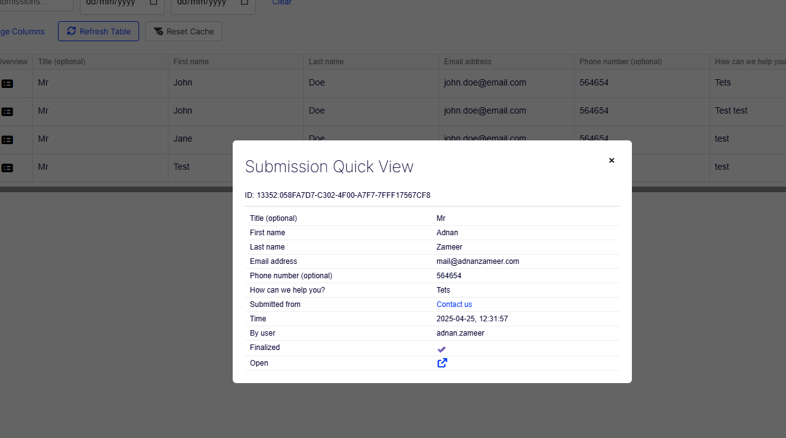
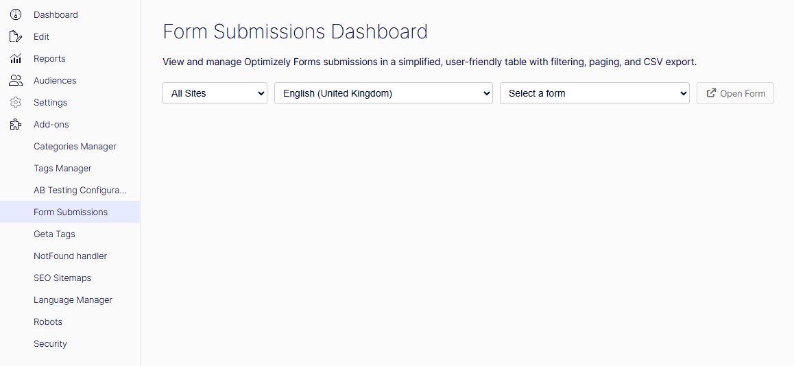
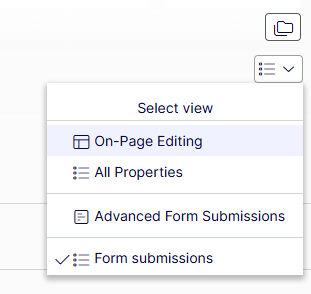
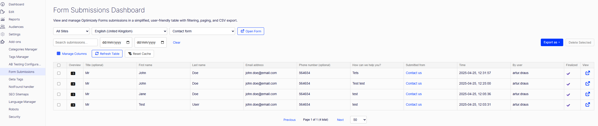

# Advanced Form Submissions Add-on for Optimizely Forms (CMS 12)

This add-on is designed as an alternative of the standard Optimizely Forms submissions view with a more powerful, user-friendly dashboard optimized for efficiency and data management in Optimizely CMS 12 (.NET Core).

[](https://dotnet.microsoft.com/) 
[](https://world.optimizely.com/) 

## What is this Add-on?

This add-on addresses common pain points with the default Optimizely Forms submissions view, such as the lack of user preference persistence and limited display options. It provides a new, centralized, and highly optimized dashboard built to make managing form data easier.

## Key Features for Editors and Administrators

The new dashboard transforms your workflow for handling form data:

### 1. Personalized and Persistent Dashboard
* **Customizable Grid:** You have full control over the submissions table. You can **reorder** columns and **hide** any fields you don't need (e.g., system fields or irrelevant data).
* **Settings Persistence:** Your layout choices (hidden columns, column order) are saved automatically (likely using local storage) and are specific to you, the user. The next time you open the dashboard, your preferred view will load instantly.
* **Optimized Performance:** The underlying system is built for speed, using paged API calls to handle even very large forms efficiently.

### 2. Advanced Data Filtering and Search
The dashboard features dedicated controls for quickly narrowing down your submissions:
* **Contextual Filtering:** Filter data by **Site**, **Language**, and **Form** block.
* **Search by Content:** Use a dedicated search box to find specific entries across submission data.
* **Date Range Filtering:** Easily select a **From Date** and **To Date** to view submissions within a specific period.

### 3. Management and Export Tools
* **Export Options:** Export your filtered submission data instantly into various formats:
    * **CSV** (Comma Separated Values)
    * **XML** (Extensible Markup Language)
    * **JSON** (JavaScript Object Notation)
* **Delete Submissions:** Securely delete selected or filtered form entries from the system.
* **Direct Form Link:** If you need to view or edit the original form definition, a button provides a **one-click link** to the Form Container Block in the CMS editing view.

### 4. Enhanced Submission Data Display
The add-on includes specialized handling to make certain data types more useful during review (seen in the Quick View modal):
* **Clickable File Uploads:** For submissions that included a **File Upload Element**, the path to the uploaded file is automatically converted into a **clickable HTML link**. This allows you to immediately open or download the submitted document or image.
* **Robust Selection Fields:** For `Selection Element Blocks` (like checkboxes, radio buttons, or dropdowns), the system more reliably identifies and displays the selected options during the quick view process, even if the form item's internal value and displayed caption differ.



### 5. View Submission on Page (Form Hydration)
* **One-Click Page Preview:** Editors and administrators can open a submitted form **directly on the original page** by clicking the **View on page** button in the dashboard.
* **Pre-Filled Form State:** The page loads with the form **hydrated using the selected submission**, allowing users to see exactly how the form appeared when it was submitted.
* **Safe Editing Workflow:** Non-encrypted fields can be reviewed or amended where appropriate, while encrypted fields remain blank by design.
* **Permission Aware:** This feature is only available to authorized users and fully respects Optimizely Forms security and access rules.

## How to Access the New Dashboard

The new dashboard is accessible from two primary locations in the Optimizely CMS user interface:

### 1. Global Navigation Menu
The most direct way to access the dashboard:
* Click the **Global Menu** (the 'hamburger' icon) in the upper-left corner of the CMS.
* Navigate to the new menu item labeled **"Form Submissions"**.



### 2. From the Form Container Block
For context-specific access to a specific form's data:
* Navigate to a page containing your **Form Container Block** in the CMS Edit view.
* Select the **Form Container Block**.
* In the asset/properties panel, select the custom view named **"Advanced Form Submissions"**. This will open the dashboard pre-filtered to show only submissions for that form.



## Installation

### Register the addon in Startup or Program

Add the service registration during application startup.

```csharp
using AdvancedFormSubmissions;

builder.Services.AddAdvancedFormSubmissions();
```

This registration:
- Registers the module and protected client resources
- Adds a Razor view location expander for module views
- Registers the default authorization policy `form:submissions`
- Applies the same policy to CMS menu items and controller endpoints

## Authorization and Security

### Default policy behavior

By default, the `form:submissions` policy allows users in these roles:
- CmsAdmins
- WebAdmins
- Administrators

This policy is used consistently across:
- CMS menu visibility
- Dashboard controller access
- Front-end form hydration

### Customizing the policy

You can override the policy definition when registering the addon.

#### Role-based policy example

```csharp
builder.Services.AddAdvancedFormSubmissions(policy =>
{
    policy.RequireRole("CmsAdmins", "WebAdmins", "FormManagers");
});
```

#### Claims-based policy example

```csharp
builder.Services.AddAdvancedFormSubmissions(policy =>
{
    policy.RequireAuthenticatedUser();
    policy.RequireClaim("permission", "forms:submissions");
});
```

## CMS Integration Overview

Once installed, the addon provides:

- A CMS menu item under **CMS > Form Submissions**
- A dashboard endpoint at `/AdvancedFormSubmissions/Index`
- A custom view configuration for `FormContainerBlock` named **Advanced Form Submissions**

All of the above are protected by the same authorization policy.

## Front-end Form Hydration

Form hydration allows editors or administrators to open a form with values prefilled from a previous submission.



### How hydration is triggered

Hydration activates only when:
- A valid `submissionId` exists in the query string
- The current user passes the `form:submissions` policy
- Submission data can be loaded from storage

If any condition fails, the form renders normally without hydration.

## Enabling Hydration in Your Form View

### 1. Ensure access to the FormContainerBlock

Your page or block view model must expose the `FormContainerBlock`.

### 2. Inject hydration assets

Add this once in your form view:

```cshtml
@using AdvancedFormSubmissions.Helpers

@Html.RenderHydratedFormAssets(Model)
```

This conditionally injects the addon CSS and JavaScript only when hydration is active.

## Rendering Form Elements with Hydration

### Default Optimizely rendering

```cshtml
@Html.RenderElementsInStep(step.i, step.value.Elements)
```

### Replace with hydrated rendering

```cshtml
@Html.RenderElementsHydrated(step.i, step.value.Elements, Model)
```

This swaps form elements with hydrated clones when applicable and resets predefined values otherwise.

## Using a Custom Form Element Renderer

If your project already has a custom renderer, you can reuse it with hydration.

```cshtml
@Html.RenderElementsHydrated(
    step.i,
    step.value.Elements,
    Model,
    HtmlHelpers.RenderForm
)
```

Your renderer must match this signature:

```csharp
using EPiServer.Forms.Core.Models;
using Microsoft.AspNetCore.Mvc.Rendering;

public static class HtmlHelpers
{
    public static void RenderForm(
        this IHtmlHelper html,
        int currentStepIndex,
        IEnumerable<IFormElement> elements)
    {
        // Your existing rendering logic
    }
}
```

If no renderer is provided, the default Optimizely `RenderElementsInStep` method is used.


## Extending Hydration for Custom Form Elements

Hydration is extensible via `IFormPredefinedValueHandler`.

### How the handler pipeline works

- Each form element is cloned before modification
- The resolver selects the first handler where `CanHandle` returns true
- Handlers are ordered by `Priority`
- A fallback handler attempts to set `PredefinedValue` via reflection

Built-in handlers exist for common Optimizely Forms elements:
- Textbox
- Number
- Url
- Selection (checkbox, radio, dropdown)
- File upload
- Default fallback


## Creating a Custom Predefined Value Handler

Example for a custom element block:

```csharp
using AdvancedFormSubmissions.Models;
using EPiServer.Forms.Core;
using EPiServer.ServiceLocation;

[ServiceConfiguration(ServiceType = typeof(IFormPredefinedValueHandler))]
public class MyCustomElementPredefinedValueHandler : IFormPredefinedValueHandler
{
    public int Priority => 150;

    public bool CanHandle(ElementBlockBase element)
        => element is MyCustomElementBlock;

    public void Clear(ElementBlockBase element)
    {
        var e = (MyCustomElementBlock)element;
        e.PredefinedValue = string.Empty;
    }

    public void SetValue(ElementBlockBase element, string value)
    {
        var e = (MyCustomElementBlock)element;
        e.PredefinedValue = value;
    }
}
```

## Dashboard Settings Persistence

The dashboard stores user preferences per:
- Form
- Language
- User identity

Stored settings include:
- Column visibility
- Column order

These settings are persisted in DDS and scoped to the current user.

## Security Model Summary

### Layer 1: Global access
Controlled by the `form:submissions` policy:
- CMS menu visibility
- Dashboard endpoints
- Front-end hydration activation

### Layer 2: Per-form access
Validated against the form’s content security descriptor and Forms configuration.


## Limitation: Encrypted Form Submissions

This addon does **not support reading or hydrating encrypted Optimizely Forms fields**.

When a form field is marked as encrypted:
- The value is encrypted before storage
- The original value cannot be retrieved via public APIs
- Decryption is intentionally not exposed by Optimizely

As a result:
- Encrypted fields are **not hydrated** on the front-end
- Encrypted values are **not displayed** in the submissions dashboard
- Exports may show empty or masked values for those fields

This is a deliberate design choice to preserve Optimizely Forms security guarantees and avoid exposing sensitive data.

Non-encrypted fields in the same form continue to work normally.


## Troubleshooting

### CMS menu visible but dashboard access denied
- Verify `AddAdvancedFormSubmissions` is registered
- Confirm the user satisfies the configured policy
- Ensure authentication is enabled

### Form does not hydrate
Check:
- `submissionId` exists in the query string
- User is authorized
- Submission data exists
- `RenderHydratedFormAssets` is called
- `RenderElementsHydrated` is used


## Feature Requests

If you have new ideas or feature requests that can make this tool even more useful for you or the community, please feel free to open a new issue at the following link.

https://github.com/adnanzameer/optimizely-advanced-form-submissions/issues

## Changelog

[Changelog](CHANGELOG.md)
