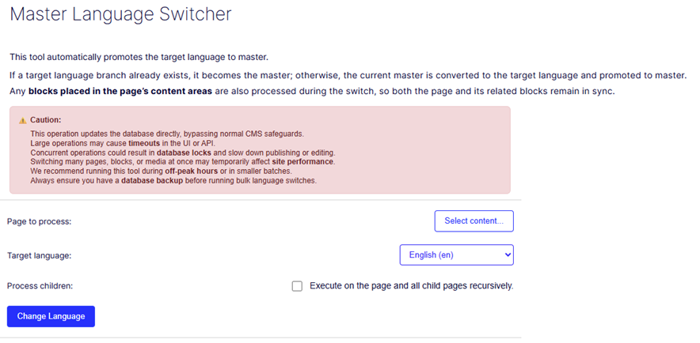
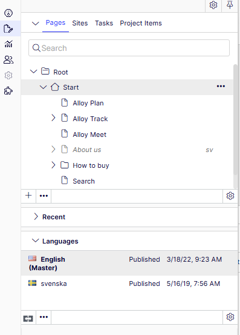
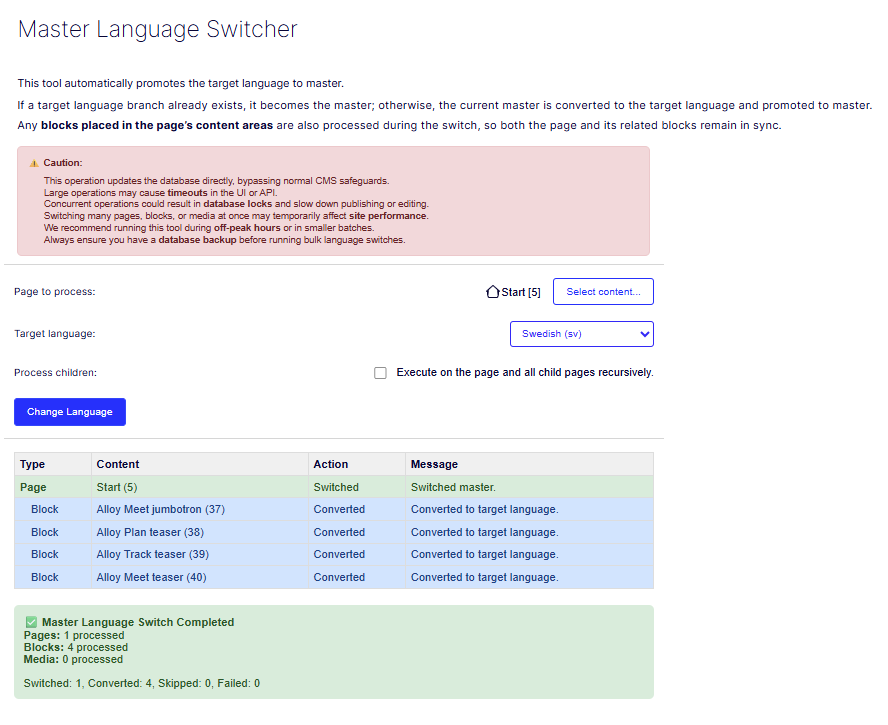
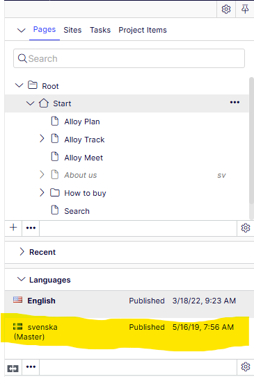
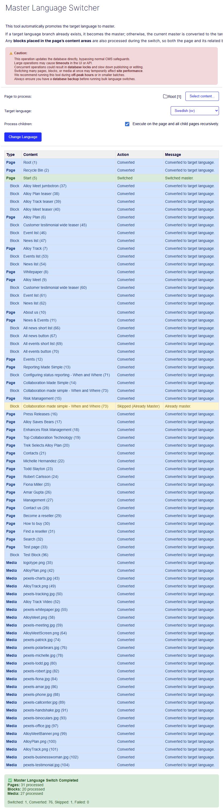

# Master Language Switcher

The **Master Language Switcher** is an admin tool for Optimizely CMS 12 that allows editors and developers to **switch or convert master languages** of pages, blocks, and media directly at the database level.  

It mirrors the legacy database-driven approach, while providing **UI feedback and batch processing** for safe and transparent execution.

 
 

## Features

- Promote a target language branch to **master**.
- If a target language already exists, it becomes the master (**switch**).
- If no target language exists, the current master is converted to the target (**convert**).
- Processes:
  - **Pages** (selected page and optionally descendants)
  - **Blocks** placed in page content areas
  - **Media** referenced within pages
- Batch processing to reduce lock times and keep results consistent.
- UI feedback with **detailed results**:
  - Pages, blocks, and media separated
  - Each item shows action (`Switched`, `Converted`, `Skipped`, `Failed`)
  - Summary of totals

## Caution

This tool updates the **database directly**, bypassing normal CMS safeguards. Please read carefully before using:

- Large operations may cause **timeouts** in the UI or API.
- Running multiple operations at the same time can lead to **database locks**.
- Switching many pages, blocks, or media items at once may temporarily impact **site performance**.
- Always **back up the database** before running bulk operations.
- We recommend running this tool during **off-peak hours**.
- After switching, if you cannot see updated content in the frontend, it may be due to **CDN or application cache**.  
  - Clear the CDN cache and restart the site if needed.  
  - If you are using **Optimizely Search & Navigation**, don’t forget to **reindex the content** to reflect the new master language.

## Installation 

To install the A2Z.Optimizely.AdvancedFormSubmissions, begin by adding the NuGet package using [Optimizely NuGet](https://nuget.optimizely.com/):

`
dotnet add package A2Z.Optimizely.AdvancedFormSubmissions
`
## Usage

1. Navigate to **Admin > Tools > Master Language Switcher**.
2. Select a page, language, and options.
3. Click **Change Language**.
4. Monitor results in the UI.

## How It Works

1. Select a **root page** in the CMS tree.
2. Choose the **target language** to promote.
3. (Optional) Enable **recursive processing** to include all child pages.
4. The tool:
   - Switches/converts the page.
   - Finds blocks placed in its content areas and switches/converts them.
   - Finds media references and switches/converts them.
5. Results are displayed in a table with colored rows for clarity.

## Actions Explained

Each processed content item results in one of the following actions:

- **Switched** – Target language already exists → set as new master.
- **Converted** – Current master moved to target language.
- **Skipped (Already Master)** – Item already had the correct master.
- **Failed** – Operation failed (e.g. timeout, missing language, or other DB issue).

## UI Feedback

- **Table view**: Lists each processed page, its blocks, and media with results.
- **Summary**: Totals for pages, blocks, and media, including how many were switched, converted, skipped, or failed.
- **Overlay loader**: Displays while the switch operation is running.

## Development Notes

- Database updates are performed with raw SQL against:
  - `tblContent`
  - `tblContentProperty`
  - `tblContentLanguage`
  - `tblWorkContent`

## Screenshot (recursive)

## Feature Requests

If you have new ideas or feature requests that can make this tool even more useful for you or the community, please feel free to open a new issue at the following link.

https://github.com/adnanzameer/A2Z.Optimizely.AdvancedFormSubmissions/issues

## Changelog

[Changelog](CHANGELOG.md)